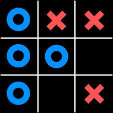

# 🕹️ Tic Tac Toe

**A classic Tic Tac Toe game built with HTML, SCSS, and JavaScript.** Test your skills and enjoy a game of strategy against friends!

## 📖 Overview

Tic Tac Toe is a simple and fun two-player game where players take turns marking spaces in a 3x3 grid. The goal is to be the first to get three of your marks in a row, either horizontally, vertically, or diagonally.

## 🎮 Features

- **Two-player Mode**: Play with a friend locally.
- **Interactive UI**: Enjoy a sleek and responsive design with smooth animations.
- **Real-time Winner Detection**: The game highlights the winning line and displays the winner.
- **Game Reset**: Easily reset the game for a fresh start.

## ✨ Technologies Used

- **HTML**: Structure and layout of the game board and interface.
- **SCSS**: Styling and design, utilizing variables, mixins, and nested rules for a responsive and modern UI.
- **JavaScript**: Game logic, winner detection, and user interactions.

## 🖼️ Screenshots

  

## 🚀 Getting Started

[Live Demo on Vercel](https://tic-tac-toe-js-r.vercel.app)

### Prerequisites

Make sure you have a modern web browser installed (Chrome, Firefox, Safari, etc.).
